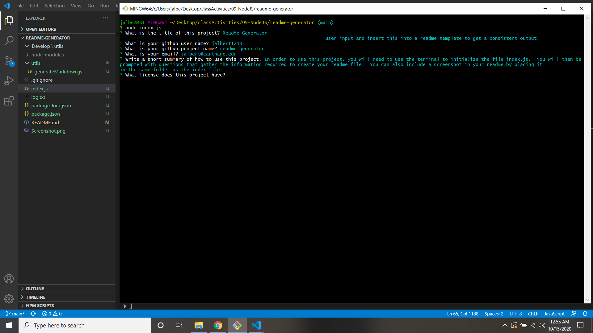

# ReadMe Generator 
## Table of Contents 
 * [About](#About) 
 * [Installation](#Installation) 
 * [Usage](#Usage) 
 * [Contributing](#Contributing) 
 * [License](#License) 
  
## About 
 This project is meant to facilitate the fast creation of a readme file for a github repository.  It will take user input and insert this into a readme template to get a consistent output. 
  
## Installation 
 1. Clone this repository at http:/readme-generator.jalbert@carthage.edu.git 
```sh 
git clone http://http://readme-generator.jalbert@carthage.edu.git
 ``` 
2. Install packages using 
```sh 
npm i
 ``` 
 
## Usage 
 In order to use this project, you will need to use the terminal to initialize the file index.js.  You will then be prompted with questions that gather the information required to create your readme file.  You can also include a screenshot in your readme by placing it in the same folder as the index file. 
## Contributing 
 If you would like to contribute to this package, please contact the author via [email](mailto:jalbert@carthage.edu).  Provide any details about your proposed chagnes so that your contribution can be made. 
## License 
 MIT License 
 
 Permission is hereby granted, free of charge, to any person obtaining a copy of this software and associated documentation files (the /'Software/'), to deal in the Software without restriction, including without limitation the rights to use, copy, modify, merge, publish, distribute, sublicense, and/or sell copies of the Software, and to permit persons to whom the Software is furnished to do so, subject to the following conditions: 
 
 The above copyright notice and this permission notice shall be included in all copies or substantial portions of the Software.  
  
 THE SOFTWARE IS PROVIDED 'AS IS', WITHOUT WARRANTY OF ANY KIND, EXPRESS OR IMPLIED, INCLUDING BUT NOT LIMITED TO THE WARRANTIES OF MERCHANTABILITY, FITNESS FOR A PARTICULAR PURPOSE AND NONINFRINGEMENT. IN NO EVENT SHALL THE AUTHORS OR COPYRIGHT HOLDERS BE LIABLE FOR ANY CLAIM, DAMAGES OR OTHER LIABILITY, WHETHER IN AN ACTION OF CONTRACT, TORT OR OTHERWISE, ARISING FROM,  OUT OF OR IN CONNECTION WITH THE SOFTWARE OR THE USE OR OTHER DEALINGS IN THE SOFTWARE. 
